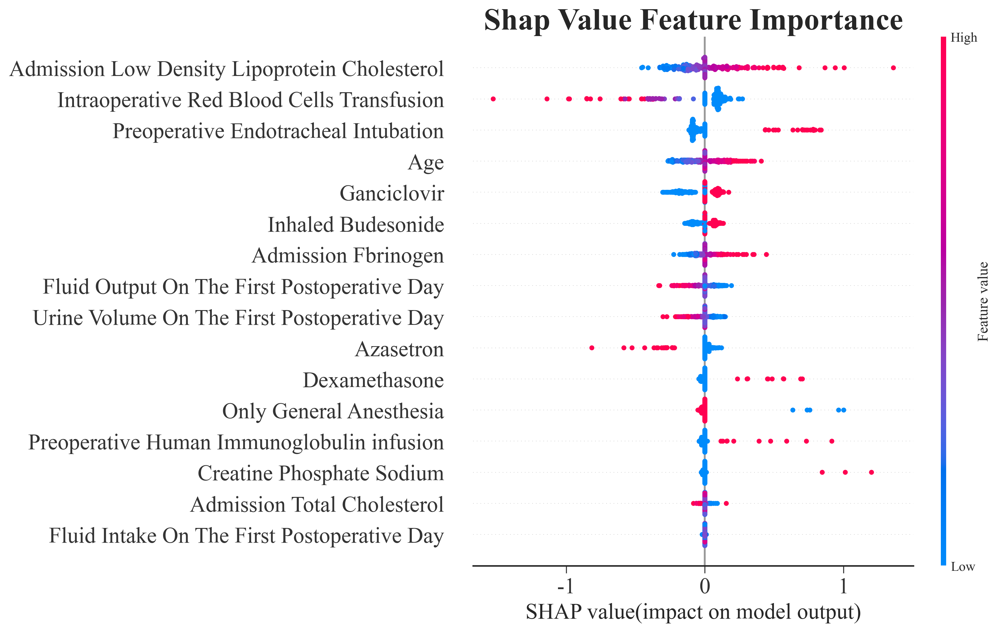
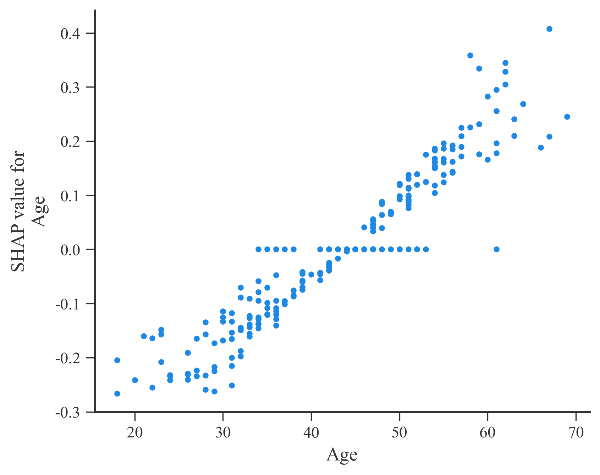
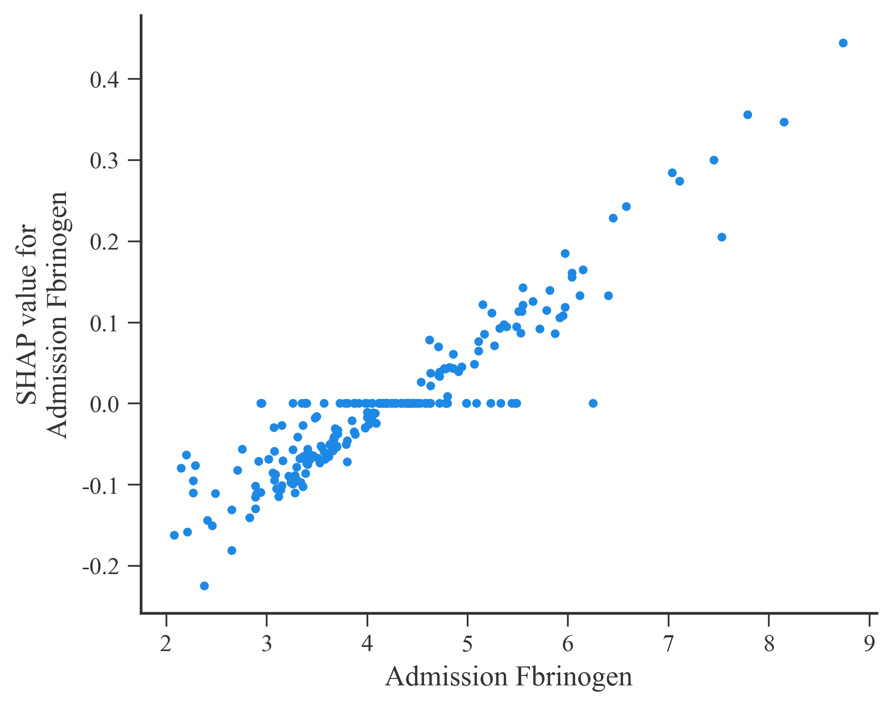
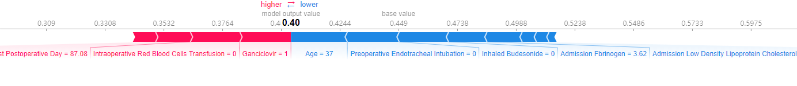
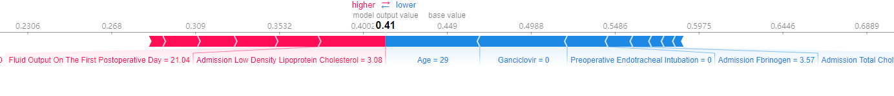
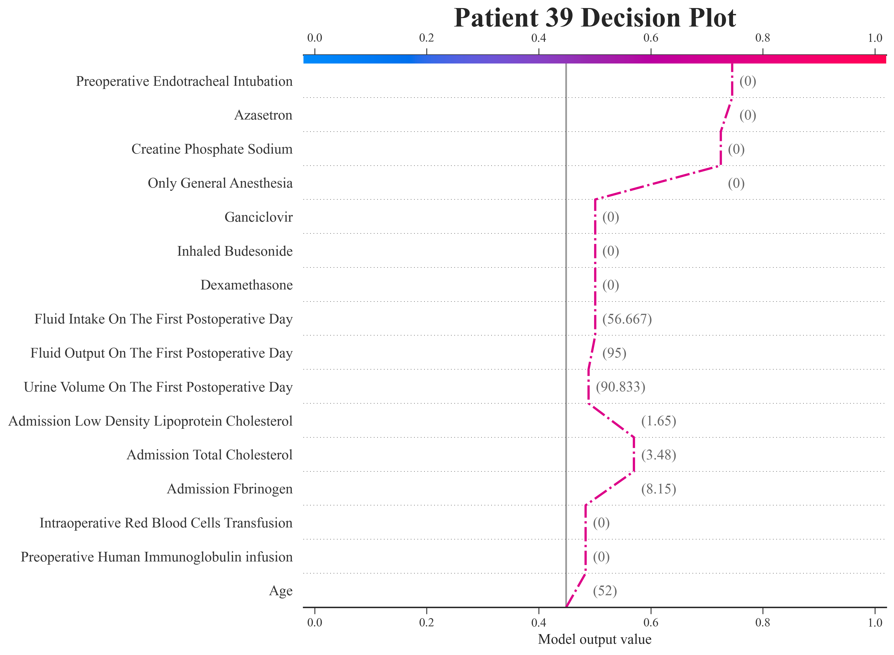
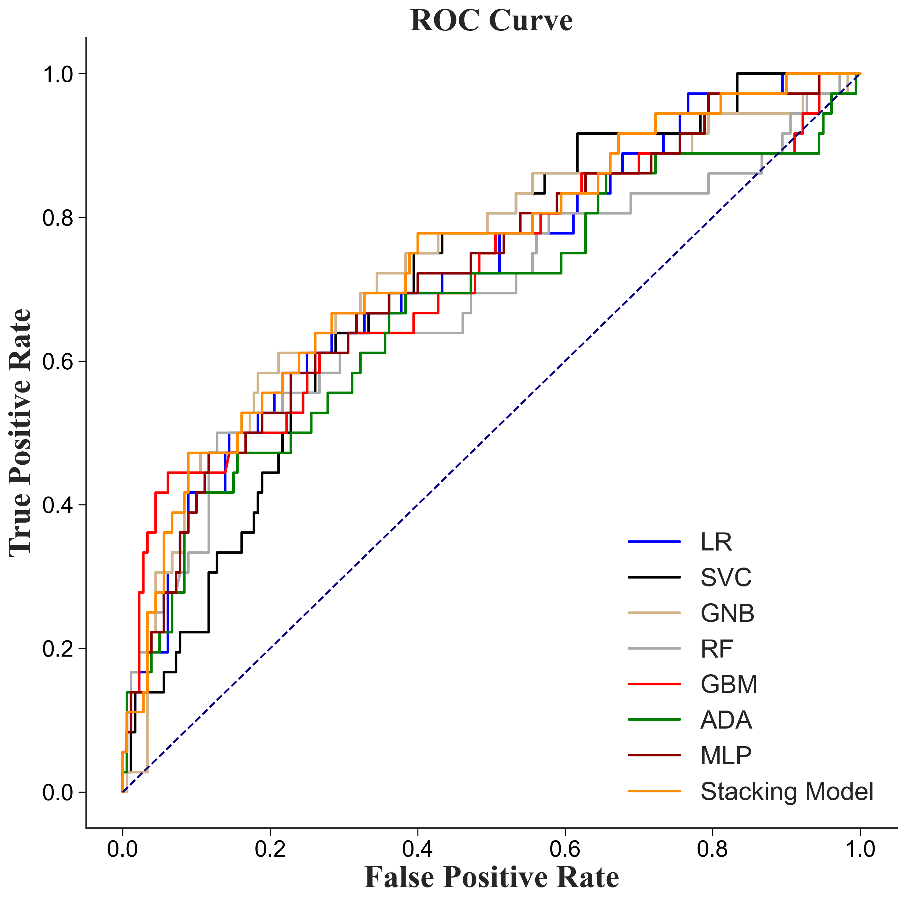
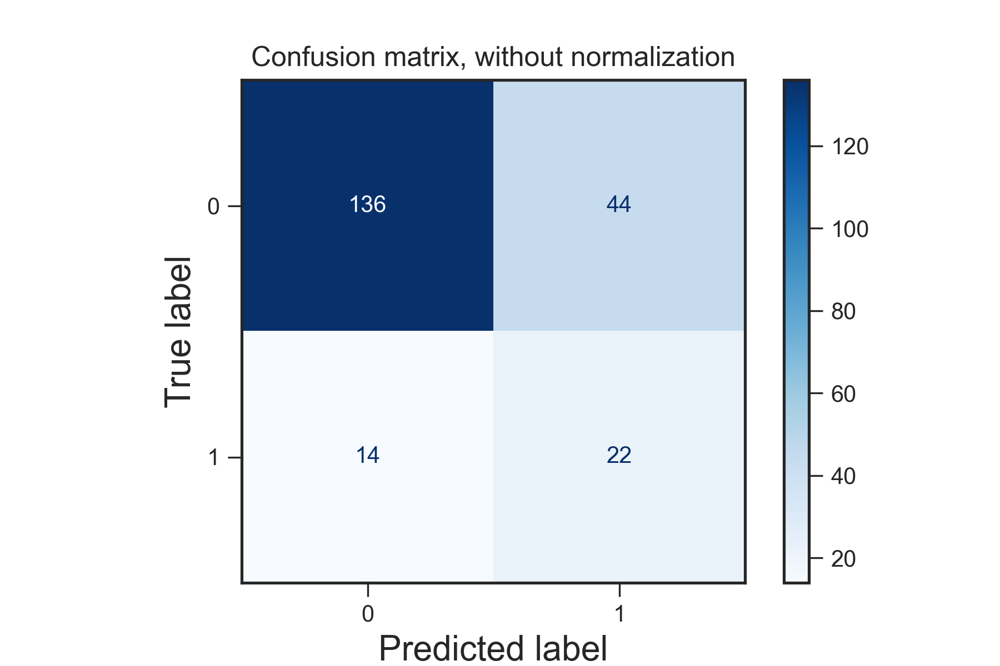

# Clinical-AI Research Framework


# Overview
Here is a Clinical Medical Research Framework, ***ClinicalTools***, which covers all the processes in Clinical Medical Research (CMR) including a lot of modules for **Statistic, Prediction and Causal Inference**, such as hypothesis testing, standardization, missing value filling, feature selection, machine learning grid search, ROC, calibration curve, confusion matrix, SHAP interpretability, etc. The purpose of this framework is to help doctors and clinical researchers implement interdisciplinary clinical AI research. Please refer to the tutorial for more details: https://github.com/ugggddd/ClinicalTools/blob/master/Tutorial.ipynb.

# Results Display

## SHAP 

### summary plot



### dependence plot




### force plot




### decision plot



## ROC



## Confusion matrix



# Usage

1. Please download Anaconda from https://www.anaconda.com/products/individual.
```
conda create -n clinical python==3.7 -y
conda activate clinical
conda install jupyter notebook -y
pip install requirements.txt
```
2. Please download the Chromedriver from https://chromedriver.chromium.org/, making sure to match the Chrome version.

3. Considering your reading experience, please install the catalog before reading.(https://zhuanlan.zhihu.com/p/24029578)


# Reference

The experimental results of the following papers can be implemented using ClinicalTools.

[1] Zhang, Y., Yang, D., Liu, Z., Chen, C., Ge, M., Li, X., ... & Hei, Z. (2021). An explainable supervised machine learning predictor of acute kidney injury after adult deceased donor liver transplantation.

[2] Chen, C., Yang, D., Gao, S., Zhang, Y., Chen, L., Wang, B., ... & Zhou, S. (2021). Development and performance assessment of novel machine learning models to predict pneumonia after liver transplantation. Respiratory research, 22(1), 1-12.

[3] Gong, K., Lee, H. K., Yu, K., Xie, X., & Li, J. (2021). A prediction and interpretation framework of acute kidney injury in critical care. Journal of Biomedical Informatics, 113, 103653.

[4] Penny-Dimri, J. C., Bergmeir, C., Reid, C. M., Williams-Spence, J., Cochrane, A. D., & Smith, J. A. (2020, September). Machine learning algorithms for predicting and risk profiling of cardiac surgery-associated acute kidney injury. In Seminars in Thoracic and Cardiovascular Surgery. WB Saunders.

[5] Tseng, P. Y., Chen, Y. T., Wang, C. H., Chiu, K. M., Peng, Y. S., Hsu, S. P., ... & Lee, O. K. S. (2020). Prediction of the development of acute kidney injury following cardiac surgery by machine learning. Critical Care, 24(1), 1-13.

# Cite

If you find this idea useful, please cite our work using the following reference:

```
@article{zhang2021explainable,
  title={An explainable supervised machine learning predictor of acute kidney injury after adult deceased donor liver transplantation},
  author={Zhang, Yihan and Yang, Dong and Liu, Zifeng and Chen, Chaojin and Ge, Mian and Li, Xiang and Luo, Tongsen and Wu, Zhengdong and Shi, Chenguang and Wang, Bohan and others},
  year={2021}
}
```

# ClinicalTools Moudles
- preprocessing
  - description.py
  - imputation.py
  - standardzation.py
- models
  - FeatureSelection: LASSO OR RFE
  - GridSearchCV (LR, SVC, GNB, GBM, ADA, MLP)
- metrics
  - evaluate.py
  - plot.py
- SHAP
  - SHAP.py
  - selenium_png.py
  - chromedriver (need to download by yourself)
- utils
  - colors.py
  - load.py (if the cvs file too large)
